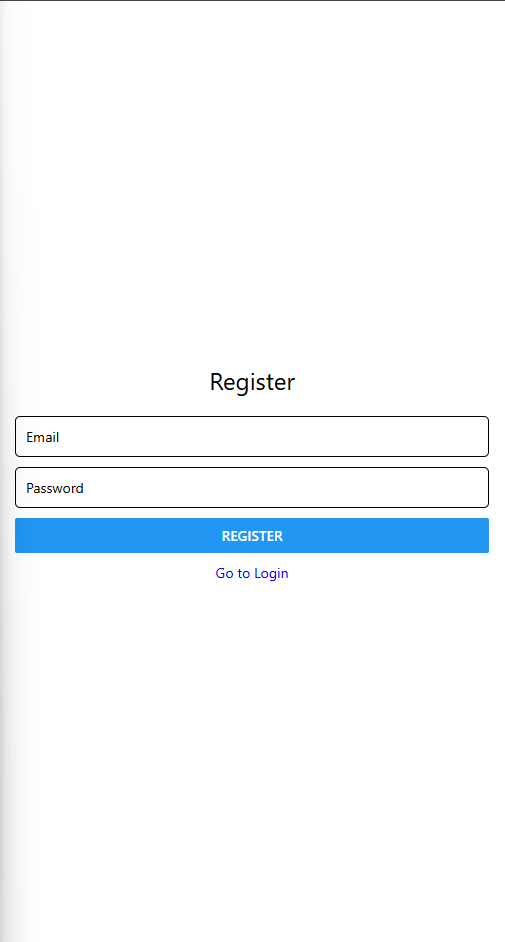

# ShopEZ - Minimal React Native Shopping App

**Note:** Cart persistence in Firebase and offline storage are not implemented in this minimal version.

## Screenshots

### Login / Register

## Installation

1. **Clone the project:**

git clone https://github.com/NqobileTwala/ShopEZ.git
cd ShopEZ

2. Install dependencies:

npm install
npm install @react-navigation/native @react-navigation/native-stack react-native-screens react-native-safe-area-context
npm install firebase

3. Start the app:
 npx expo start